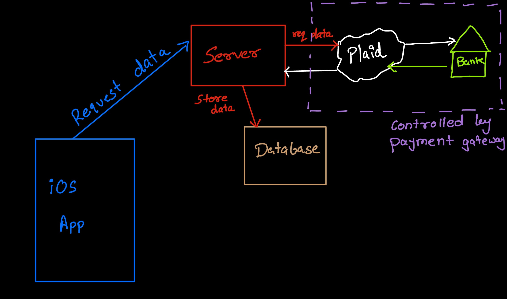

# SaveStreak

SaveStreak is a simple app that helps you keep track of your savings streaks. It's a great way to keep yourself motivated to save money.

## Market Research

I did some market research and found that there are a few apps that help you keep track of your savings, but none of them focus on keeping a streak going. I think this is a great way to keep people motivated to save money.
Apps already in the market:
- [Mint](https://mint.intuit.com/) (project discontinued)
- [Quicken](https://www.quicken.com/)

## Features To be Implemented
- Track your daily habits and activities
- Set up streaks for each habit
- Receive reminders to complete your habits
- View your progress and streak history
- Customize your streaks with personalized goals and targets
- Location-based average spend and savings data to compare your progress with others in your area.
- Set savings goals and track your progress towards achieving them.
- Keep track of your savings streaks and see how many consecutive days you've saved money.

## Tech Stack

- Swift (iOS)
- Go (Backend Server)
- Database (to be decided)
- Plaid API sandbox environment (for linking bank accounts)

## Basic Architecture

The app will be built using Swift for iOS. The backend server will be built using Go. The app will communicate with the backend server to store and retrieve data. The backend server will also communicate with the Plaid API to link bank accounts and retrieve transaction data.


## User Flow

1. User signs up
    - User enters email and password
    - User enters state and zip code
    - User enters occupation

2. User logs in
    - User enters email and password

3. User links bank account
    - Clicks on "Link Bank Account" button
    - User selects bank from Plaid API list
    - User enters bank account credentials
    - User selects bank account to link

4. Dasboard view
    - User sees current savings streak
    - User sees current savings goal
    - User sees average spend in area
    - User sees average savings in area
    - User sees progress towards savings goal
    - User sees progress towards savings streak
    - Streak is represented by something unique (e.g. a flame, a money bag, etc.)

## Contributors

- [Aman Velani](https://www.linkedin.com/in/amanvelani/)
- [Chinmay Yadav](https://www.linkedin.com/in/chinmay-yadav-668587178/)

## License

[MIT](https://choosealicense.com/licenses/mit/)
```
## License

The SaveStreak project is licensed under the MIT License.

MIT License
-----------

[MIT License](https://choosealicense.com/licenses/mit/)

Permission is hereby granted, free of charge, to any person obtaining a copy
of this software and associated documentation files (the "Software"), to deal
in the Software without restriction, including without limitation the rights
to use, copy, modify, merge, publish, distribute, sublicense, and/or sell
copies of the Software, and to permit persons to whom the Software is
furnished to do so, subject to the following conditions:

The above copyright notice and this permission notice shall be included in all
copies or substantial portions of the Software.

THE SOFTWARE IS PROVIDED "AS IS", WITHOUT WARRANTY OF ANY KIND, EXPRESS OR
IMPLIED, INCLUDING BUT NOT LIMITED TO THE WARRANTIES OF MERCHANTABILITY,
FITNESS FOR A PARTICULAR PURPOSE AND NONINFRINGEMENT. IN NO EVENT SHALL THE
AUTHORS OR COPYRIGHT HOLDERS BE LIABLE FOR ANY CLAIM, DAMAGES OR OTHER
LIABILITY, WHETHER IN AN ACTION OF CONTRACT, TORT OR OTHERWISE, ARISING FROM,
OUT OF OR IN CONNECTION WITH THE SOFTWARE OR THE USE OR OTHER DEALINGS IN THE
SOFTWARE.