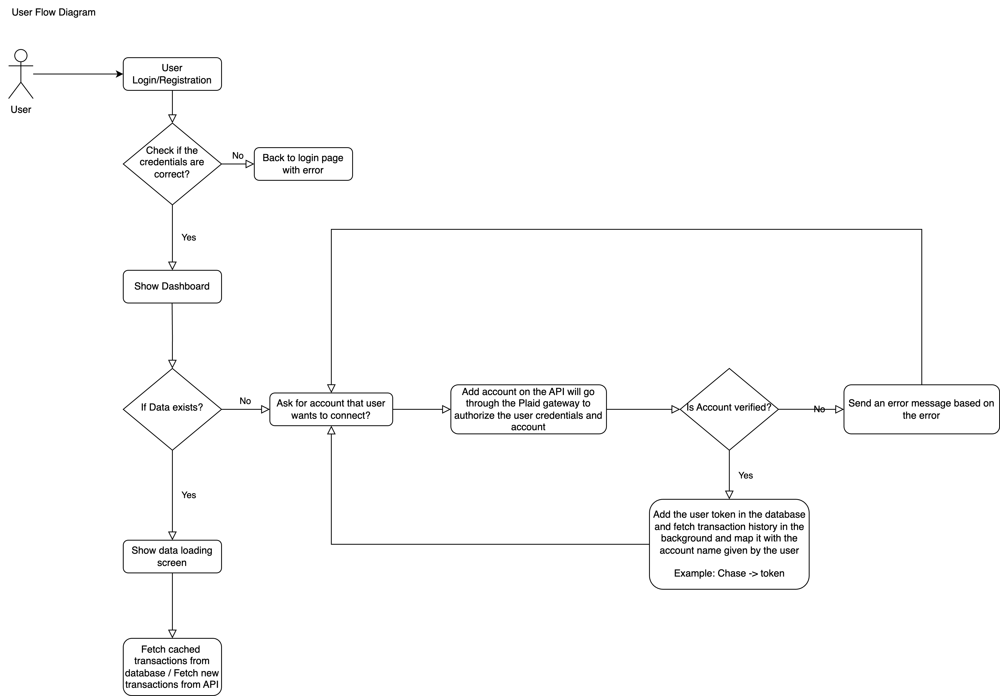
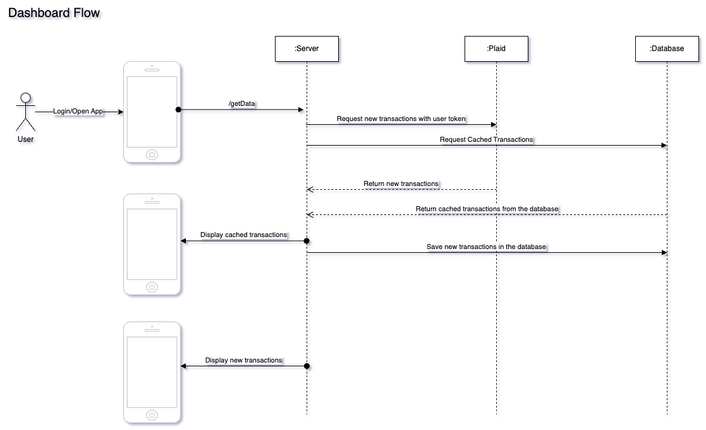
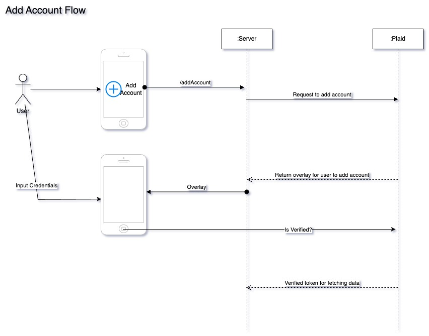

# SaveStreak

SaveStreak is a simple app that helps you keep track of your savings streaks. It's a great way to keep yourself motivated to save money.

## Table of Contents
- [Market Research](#market-research)
- [Tech Stack](#tech-stack)
- [How to run backend server](#how-to-run-backend-server)
- [How to run the iOS app](#how-to-run-the-ios-app)
- [Custom Data](#custom-data)
- [Architecture](#architecture)
- [Contributors](#contributors)


## Market Research

We did some market research and found that there are a few apps that help you keep track of your savings, but none of them focus on keeping a streak going. I think this is a great way to keep people motivated to save money.
Apps already in the market:
- [Mint](https://mint.intuit.com/) (project discontinued)
- [Quicken](https://www.quicken.com/)

## Tech Stack

- Swift (iOS)
- Flask (Backend Server)
- MongoDB (Database)
- Plaid API sandbox environment (for linking bank accounts)

## How to run backend server
1. Clone the repository
```bash
git clone https://github.com/amanvelani/SaveStreak/tree/main
```
2. Change directory to the backend folder
```bash
cd SaveStreak/server
```
3. Install the required dependencies
```bash
pip3 install -r requirements.txt
```
4. Set the environment variables
```bash
cp .env.example .env
```
5. Run the server
```bash
python3 flask_app.py
```

The server is also running on `https://save-streak.live`

## How to run the iOS app
1. Import the project in Xcode from the `SaveStreak/app` folder
2. Run the project in Xcode
3. If you are running you own server change the [APIConfig.swift](./app/SaveStreak/SaveStreak/Models/APIConfig.swift) file to point to your server


## Custom Data
In this project we are using the Plaid API to get the transactions. We are using the sandbox environment of the Plaid API. The Plaid API has a few test accounts that we can use to get the transactions. The test accounts can be created using the following files:

1. [Random User Data](./data/random_user_data_generator.py) - This file is used to generate random user data. The file generates random user data and saves it in the `custom_user_data/` folder.
2. [Custom Location Data](./data/random_location_data_generator.py) - This file is used to generate random location data. The file generates random location data and saves it in the database. We are using the location data to set the location of the transactions as the plaid sandbox environment does not provide the location of the transactions.
3. [Category Data](./data/save_categories.py) - This file is used to generate category data. The file generates category data and saves it in the database. We are using the category data to set the category of the transactions as the plaid sandbox environment provides only 1-2 categories for the transactions. We are using the category data to set the category of the transactions.

## Architecture
1. User Flow Diagram

2. Dashboard Flow Diagram

3. Add Account Flow Diagram



## Contributors

- [Aman Velani](https://www.linkedin.com/in/amanvelani/)
- [Chinmay Yadav](https://www.linkedin.com/in/chinmay-yadav-668587178/)